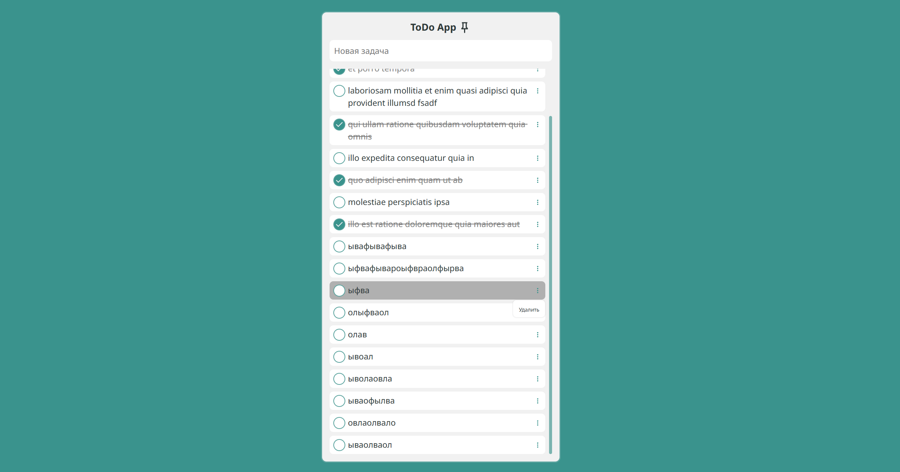

# ToDoApp
Тестовое от JavaCode

Цель - создать ToDo App приложение.
Основные требования:
1. Должны быть основные действия CRUD (Create, Read, Update, Delete)
2. При Delete должно появляться модальное окно с подтверждением
   
Ограничения по технологиям нет - основное требование - использование React и функциональных компонентов, использование state manager. Можно использовать любой state manager, написание кода на JavaScript возможно, на TypeScript - приветствуется. Можно использовать любую UI библиотеку. Ограничений или требований по стилям нет.

## Запуск приложения
1. Установить зависимости `npm install`
2. Запустить приложение `npm run dev`

## О решении
В качестве API для приложения использовался JSONPlaceholder.

Стек используемых технологий:
- React
- Vite
- MobX
- Axios
- normalize.css
- ts

Основной упор при реализации был на детальную проработку компонентов, удобство использования.

## Демонстрация

